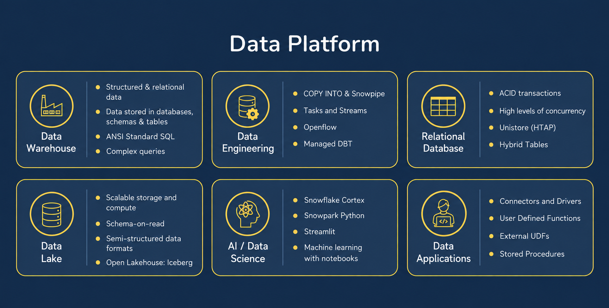
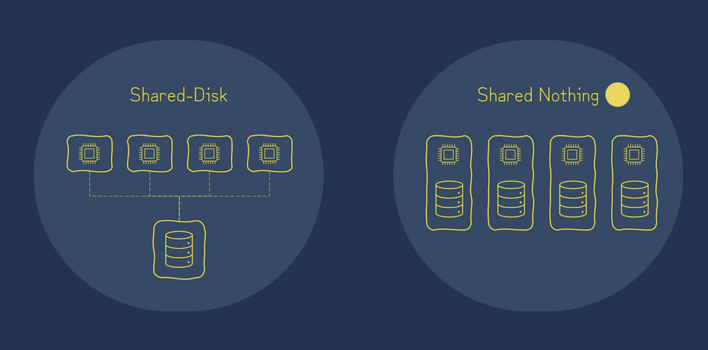
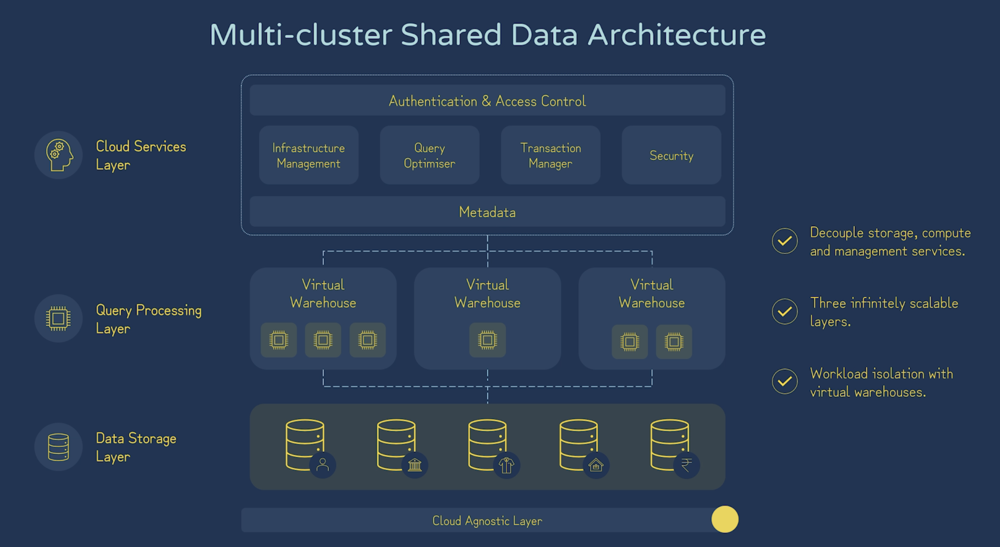

# Snowflake AI Data Cloud Features and Architectures

## What Is Snowflake?

- Snowflake began as a cloud data warehouse and has evolved into a cloud data platform for analytics, data engineering, data applications, and AI workloads.

## Multi-Cluster Shared Data Architecture

- Two common data-architecture patterns are **shared disk** and **shared nothing**.

### Shared Disk

- **Advantages:** Simple to manage and provides a single shared source of data.
- **Limitations:** Shared storage can become a bottleneck and may introduce network latency or limit scalability.

### Shared Nothing

- **Advantages:** Each node owns its compute and local storage, which can reduce network traffic and scale out effectively.
- **Limitations:** Storage and compute are tightly coupled, which makes data management and rebalancing more complex.

## Table Types

| Table Type | Time Travel | Fail-safe | Typical Use | Lifetime |
| --- | --- | --- | --- | --- |
| Permanent | Configurable; up to 90 days, depending on the account edition | Yes | Default choice for persistent business data | Until explicitly dropped |
| Temporary | Up to 1 day | No | Session-specific, temporary work | Ends when the session ends |
| Transient | Up to 1 day | No | Data that does not require fail-safe protection | Until explicitly dropped |
| External | No | No | Read-only access to data stored outside Snowflake, such as Amazon S3 | Defined until explicitly dropped |

## View Types

### Standard Views

- Store the query definition, not its result set.
- Help simplify complex queries and restrict the rows or columns users can access.

### Materialized Views

- Store precomputed query results and refresh them automatically.
- Incur storage and maintenance costs; Snowflake uses serverless compute for automatic maintenance.

Both standard and materialized views can be made secure by adding the `SECURE` keyword to their definitions.

## Worksheets and Workspaces
