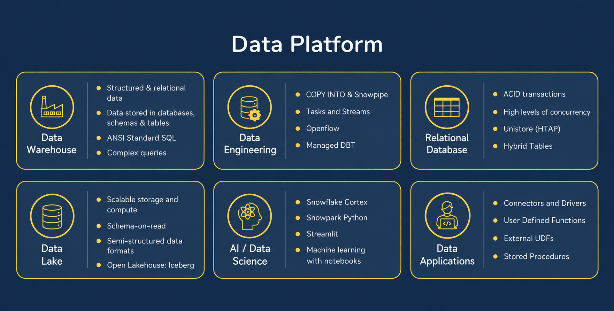
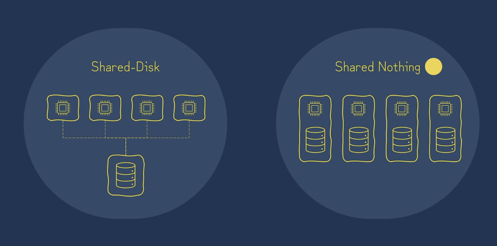
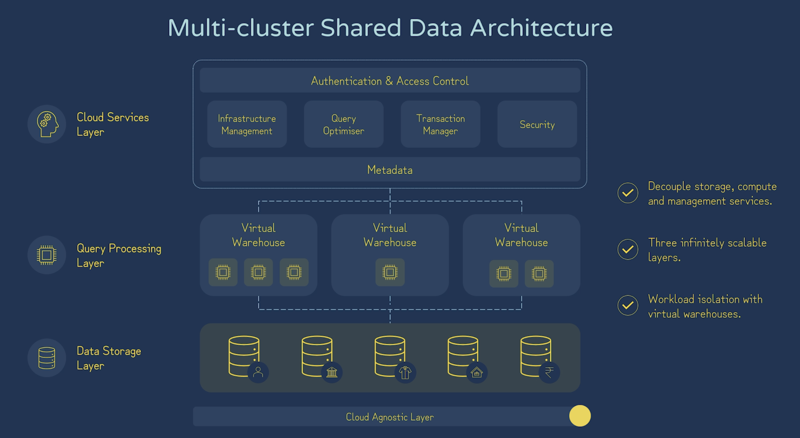
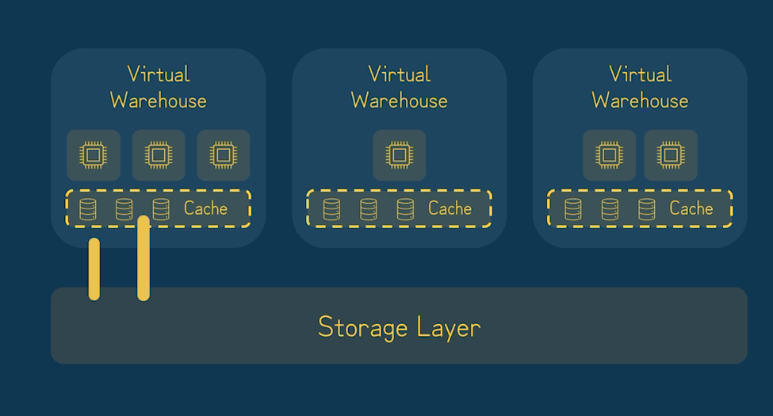
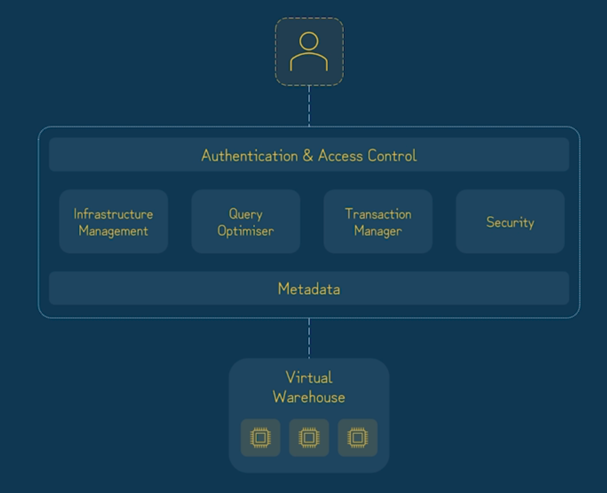
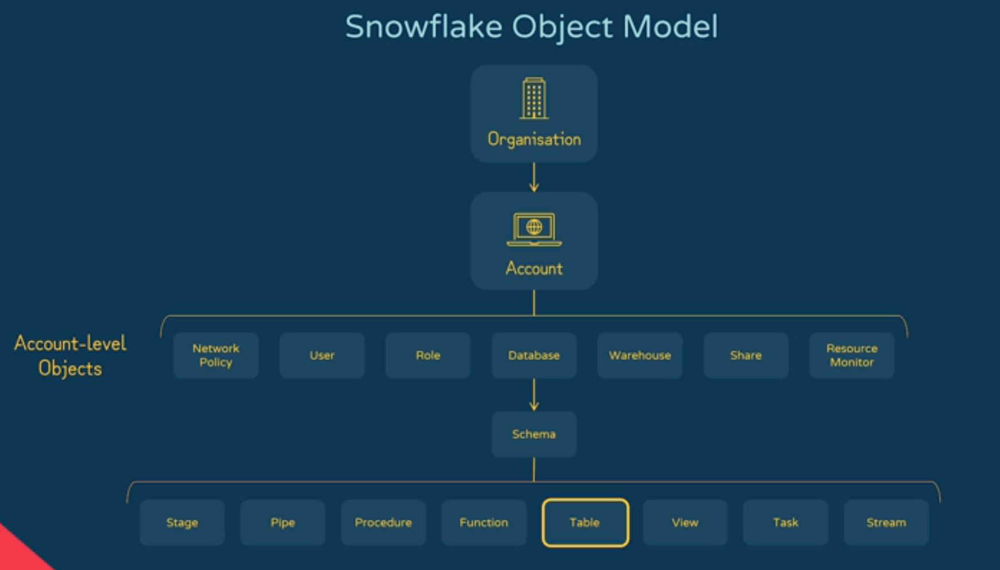

# Snowflake AI Data Cloud Features and Architectures

## What Is Snowflake?

- Snowflake began as a cloud data warehouse and has evolved into a cloud data platform for analytics, data engineering, data applications, and AI workloads.


    


## Multi-Cluster Shared Data Architecture

- Two common data-architecture patterns are **shared disk** and **shared nothing**.

    

### Shared Disk

- **Advantages:** Simple to manage and provides a single shared source of data.
- **Limitations:** Shared storage can become a bottleneck and may introduce network latency or limit scalability.

### Shared Nothing

- **Advantages:** Each node owns its compute and local storage, which can reduce network traffic and scale out effectively.
- **Limitations:** Storage and compute are tightly coupled, which makes data management and rebalancing more complex.

### Snowflake Architecture

- Snowflake follows "Multi-cluster shared-data architecture" which decouples storage and compute which allows to scale indefinitely. Generally, snowflake services can be categorzied into three separate layers like below image.

    

## Storage layer

- Snowflake data are stored in cloud provider blob stroage like AWS S3 storage. It gives the durability and availability of that cloud storage provider. In the case of AWS, 99.9999 percent.
- Data are organized into database -> schema -> table. Data can be both both structured and semi-structured also. 
- Data are organized into snowflake proprietary **compressed**, **columnar** table file format.
- Storage is billed by how much is stored based on the flat rate **per TB** calculated **monthly**.

## Query Processing Layer

- It consists of "Virtual Warehouses" that executes the processing tasks required to return results for most SQL statements.

- The SQL query to create the warehouse instance is:

 ``` CREATE WAREHOUSE MY_WH WAREHOUSE_SIZE=LARGE; ```

- It implements similar way to a share-nothing compute clusters making use of local caching.

- Virtual warehouse can be came in different sizes starting from XS.

    

## Services Layer

- It is reffered as **global services layer** since it is a colleciton of highly available and scable services that coordinates activities across all snowflake accounts.

    

## Snowflake Edition

- There are four editions of snowflake.
 - Standard Edition
 - Enterprise Edition (all standard edition features plus additional features like multi-cluster compute)
 - Business Critical (which can enable private connectivity to snowflake account)
 - Virtual Private Snowflake (which is suitable for high security data platform which requires data protection and security)

 ## Snowflake Object Model

 - Snowflake’s object hierarchy helps keep your data organized, secure, and easy to find. Every object in the snowable is **securable**.

 - **Organization**: It is the highest level in Snowflake's hierarchy. It is comprised of one or more Snowflake accounts.

 - **Container**: A container holds and organizes objects. Containers are used to logically group objects, helping you manage access and organize data efficiently.

    - For instance, a database in Snowflake is a container that holds multiple schemas and objects.

- **Object**: In Snowflake (and databases in general), an "object" refers to any individual entity that can store or manipulate data.

    - Examples: tables , views , and schemas. Objects are the fundamental building blocks in Snowflake.

    


## Table Types

| Table Type | Time Travel | Fail-safe | Typical Use | Lifetime |
| --- | --- | --- | --- | --- |
| Permanent | Configurable; up to 90 days, depending on the account edition | Yes | Default choice for persistent business data | Until explicitly dropped |
| Temporary | Up to 1 day | No | Session-specific, temporary work | Ends when the session ends |
| Transient | Up to 1 day | No | Data that does not require fail-safe protection | Until explicitly dropped |
| External | No | No | Read-only access to data stored outside Snowflake, such as Amazon S3 | Defined until explicitly dropped |

## View Types

### Standard Views

- Store the query definition, not its result set.
- Help simplify complex queries and restrict the rows or columns users can access.

### Materialized Views

- Store precomputed query results and refresh them automatically.
- Incur storage and maintenance costs; Snowflake uses serverless compute for automatic maintenance.

Both standard and materialized views can be made secure by adding the `SECURE` keyword to their definitions.

## Worksheets and Workspaces
